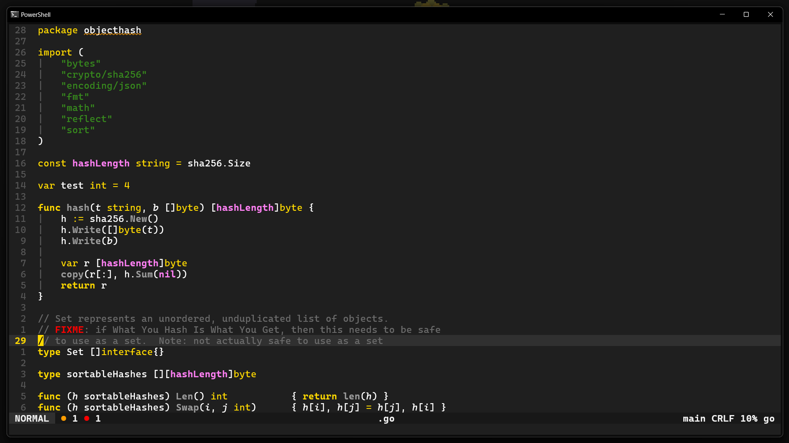
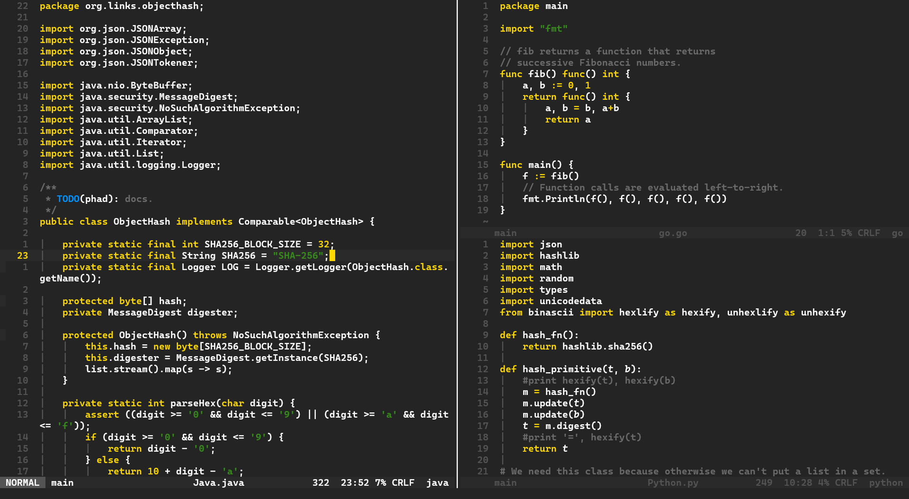
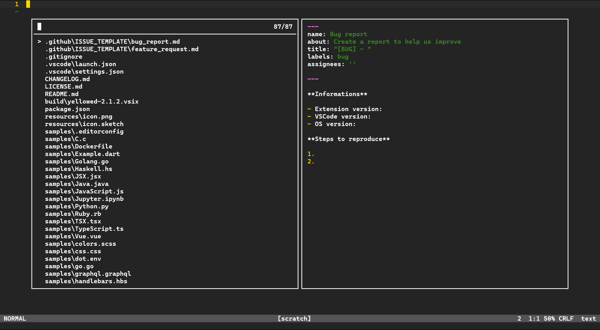

<h3 align="center">
   Yellowed
</h3>

---

  :gear: Yellowed is a simple material dark theme wich focus his syntax color on the golden yellow. Its syntax is inspired by the <a href="https://github.com/rexim/gruber-darker-theme">gruber-darker</a> theme for emacs, but changed a bit.

---

<!-- https://shields.io/ -->

### :framed_picture: Screenshots

### :question: How to install ?
To install you just need to put the `yellowed.toml` file into the themes folder of your Helix config folder. This one should be on `~/.config/helix/themes` on linux or `%AppData%\helix\themes` on windows.

### :gear: Color Palet
~~~
Interface
yellow      - [#ffd900]
gray        - [#2a2a2a]
dark_gray   - [#242424]
light_gray  - [#545454]
purple      - [#994c92]
blue        - [#008DFF]
menu        - [#202020]
selection   - [#3f3f3f]

Syntaxe
text        - [#FFFFFF]
comment     - [#6b6b6b]
string      - [#378b1d]
constants   - [#ff80f4]
keywords    - [#ffd900]
warning     - [#FF9C00]
error       - [#FF0000]
info        - [#0092FF]
hint        - [#4DFF00]
~~~