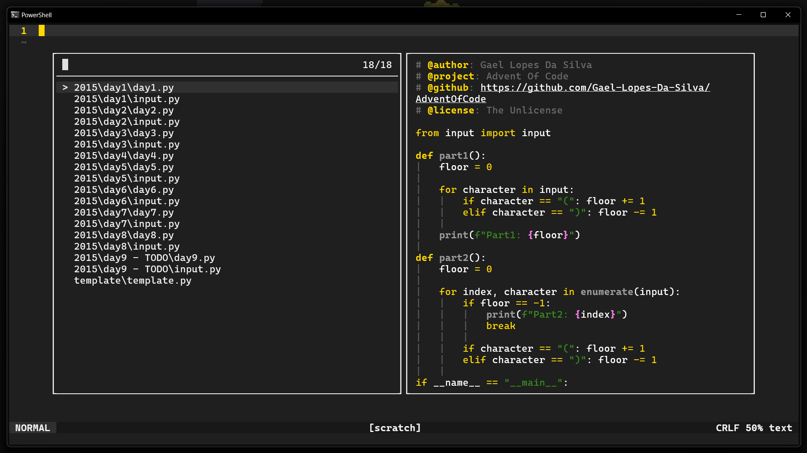

	<h1>Yellowed Helix</h1>
    <a href="https://github.com/Gael-Lopes-Da-Silva/YellowedHelix">https://github.com/Gael-Lopes-Da-Silva/YellowedHelix</a>

Description
------------------------------------------------------------------

Yellowed is a simple material dark theme wich focus his syntax color on the golden yellow. Its syntax is inspired by the [gruber-darker](https://github.com/rexim/gruber-darker-theme) theme for emacs.

Screenshots
------------------------------------------------------------------

Installation
------------------------------------------------------------------

To install the theme you just need to put the `yellowed.toml` file into the themes folder of your Helix config folder. This one should be on `~/.config/helix/themes` on Linux or `~/AppData/Roaming/helix/themes` on Windows. See [here](https://docs.helix-editor.com/themes.html) for more informations.

Colors
------------------------------------------------------------------

~~~toml
# colors
black        = "#101010"
white        = "#FFFFFF"
green        = "#378B1D"
red          = "#FF0000"
blue         = "#008DFF"
gray         = "#1F1F1F"
dark_gray    = "#181818"
light_gray   = "#303030"
smoke        = "#565656"
yellow       = "#FFD900"
purple       = "#994C92"

# interface
warning      = "#FF9C00"
error        = "#FF0000"
info         = "#008DFF"
hint         = "#008DFF"
deprecated   = "#4f4f4f"
unnecessary  = "#4f4f4f"

# syntax
text         = "#FFFFFF"
comment      = "#6B6B6B"
string       = "#378B1D"
constants    = "#FF80F4"
keywords     = "#FFD900"
function     = "#9B9B9B"
~~~
