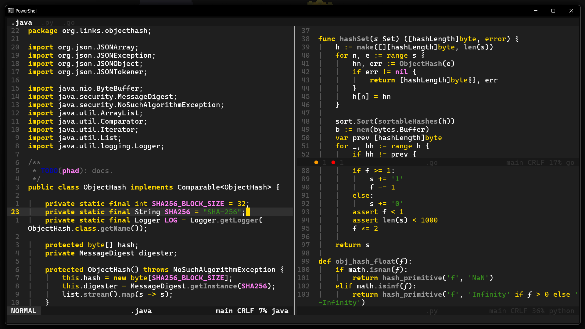

	<h1>Yellowed</h1>

### 🗒️ Yellowed is a simple material dark theme wich focus his syntax color on the golden yellow. Its syntax is inspired by the [gruber-darker](https://github.com/rexim/gruber-darker-theme) theme for emacs, but changed a bit.

## 🖼️ Screenshots

## ❓ How to install ?
To install the theme you just need to put the `yellowed.toml` file into the themes folder of your Helix config folder. This one should be on `~/.config/helix/themes` on linux or `%AppData%\helix\themes` on windows. See [here](https://docs.helix-editor.com/themes.html) for more informations.

## ⚙️ Color Palet
~~~
# interface
gray         = "#1F1F1F"
dark_gray    = "#181818"
light_gray   = "#303030"
smoke        = "#565656"
yellow       = "#FFD900"
purple       = "#994C92"
blue         = "#008DFF"
warning      = "#FF9C00"
error        = "#FF0000"
info         = "#0006ab"
hint         = "#0006ab"
deprecated   = "#4f4f4f"
unnecessary  = "#4f4f4f"

# syntax
text         = "#FFFFFF"
comment      = "#6B6B6B"
string       = "#378B1D"
constants    = "#FF80F4"
keywords     = "#FFD900"
function     = "#9B9B9B"
~~~

#### 🗒️ You can find my Helix configuraton [here](https://github.com/Gael-Lopes-Da-Silva/MyHelixConfig).
